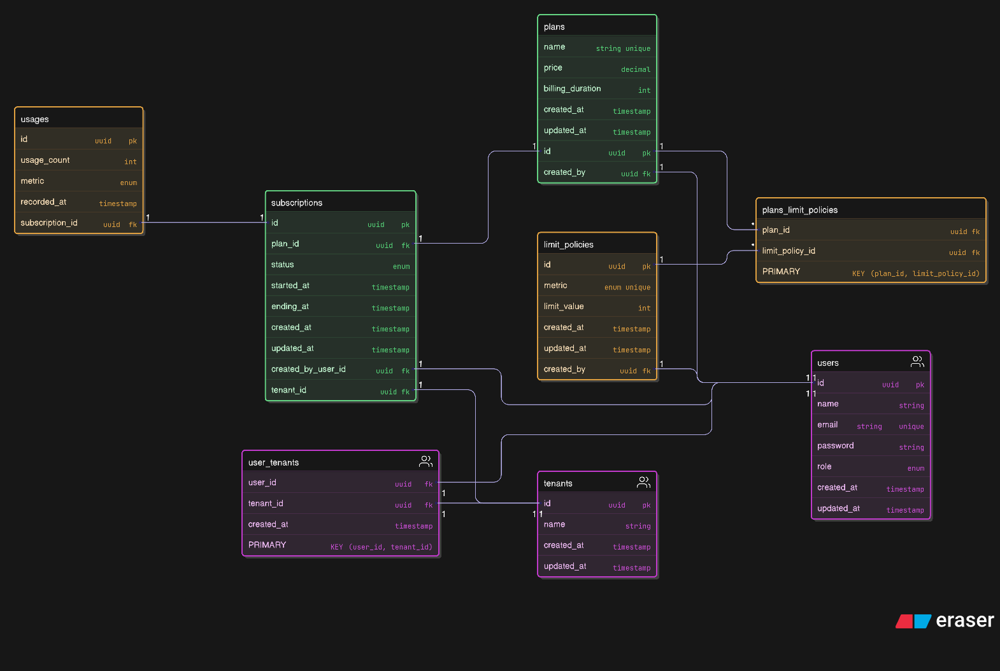

# Eshtarek - Subscription Management Platform

**Eshtarek** enables businesses to run subscription services without development overhead. This project prototypes the core engine of a multi-tenant subscription platform, supporting isolated tenant data, plan management, and subscription workflows.

## Table of Contents

- [Business Context](#business-context)
- [Architecture Overview](#architecture-overview)
- [Database Schema](#database-schema)
- [User Stories](#user-stories)
- [Tech Stack](#tech-stack)
- [Quick Start](#quick-start)
- [Project Structure](#project-structure)
- [Development Setup](#development-setup)
- [Docker Deployment](#docker-deployment)
- [Authentication](#authentication)
- [Features](#features)
- [Testing](#testing)
- [API Documentation](#api-documentation)
- [Contributing](#contributing)

## Business Context

Eshtarek is a **SaaS subscription management platform** that allows businesses to:

- Manage multi-tenant organizations with isolated data
- Create and manage subscription plans with usage limits
- Handle user authentication and role-based access control
- Track usage metrics and enforce plan limitations
- Simulate billing and payment processing workflows

## Architecture Overview

The platform follows a **multi-tenant architecture** with the following key components:

- **Frontend**: React + TypeScript with TanStack Router
- **Backend**: Django REST Framework with PostgreSQL
- **Authentication**: JWT-based authentication system
- **Database**: PostgreSQL with Row-Level Security (RLS)
- **Containerization**: Docker & Docker Compose

### Core Entities

- **Users**: Global user accounts with role-based access
- **Tenants**: Isolated organizations/companies
- **Plans**: Subscription plans with pricing and limits
- **Subscriptions**: Tenant subscriptions to plans
- **Usage Tracking**: Real-time usage monitoring and enforcement

## Database Schema



The database schema implements a robust multi-tenant architecture with:

- **Row-Level Security (RLS)** for data isolation
- **Flexible plan management** with configurable limits
- **Usage tracking** with real-time enforcement
- **Audit trails** for subscription changes

### Key Models

| Model | Description |
|-------|-------------|
| `Users` | Global user accounts with role assignment |
| `Tenants` | Organization entities with isolated data |
| `UserTenants` | Many-to-many relationship between users and tenants |
| `Plans` | Subscription plans with pricing and billing cycles |
| `LimitPolicies` | Configurable usage limits and metrics |
| `Subscriptions` | Active tenant subscriptions to plans |
| `Usages` | Real-time usage tracking per subscription |

## User Stories

For detailed user stories and acceptance criteria, see: **[User Stories](./docs/STORIES.md)**

The user stories cover:
- **Authentication & User Management**
- **Tenant Management & Subscriptions**
- **Platform Administration**
- **Usage Monitoring & Enforcement**
- **Billing & Payment Integration**

## Tech Stack

### Backend
- **Django 4.x** - Web framework
- **Django REST Framework** - API development
- **PostgreSQL** - Primary database
- **JWT Authentication** - Token-based auth
- **django-cors-headers** - CORS handling
- **drf-yasg** - API documentation

### Frontend
- **React 19** - UI framework
- **TypeScript** - Type safety
- **TanStack Router** - Client-side routing
- **TanStack Query** - Data fetching
- **Tailwind CSS** - Styling
- **Radix UI** - Component library
- **Recharts** - Data visualization
- **Jotai** - State management

### DevOps
- **Docker** - Containerization
- **Docker Compose** - Multi-service orchestration
- **Pipenv** - Python dependency management
- **pnpm** - Node.js package management

## Quick Start

### Prerequisites

- **Docker** and **Docker Compose**
- **Node.js 18+** and **pnpm** (for local frontend development)
- **Python 3.10+** and **Pipenv** (for local backend development)

### 1. Clone the Repository

```bash
git clone https://github.com/MarwanTarik/eshtarek-challenge.git
cd eshtarek-challenge
```

### 2. Environment Setup

Create a `.env` file in the project root:

```bash
# Database Configuration
DATABASE_NAME=eshtarek_db
DATABASE_USER=postgres
DATABASE_PASSWORD=your_secure_password
DATABASE_HOST=db
DATABASE_PORT=5432

# Django Configuration
DJANGO_SECRET_KEY=your-super-secret-key-here
DEBUG=true

# JWT Configuration
JWT_SECRET_KEY=your-jwt-secret-key
JWT_ALGORITHM=HS256
JWT_ACCESS_TOKEN_LIFETIME=60  # minutes
JWT_REFRESH_TOKEN_LIFETIME=1440  # minutes (24 hours)
```

### 3. Start with Docker Compose

```bash
# Build and start all services
docker-compose up --build

# Or run in detached mode
docker-compose up -d --build
```

### 4. Initialize Database

```bash
# Run migrations
docker-compose exec web python manage.py migrate

# Create superuser (optional)
docker-compose exec web python manage.py createsuperuser

# Load sample data (if available)
docker-compose exec web python manage.py loaddata fixtures/sample_data.json
```

### 5. Access the Application

- **Frontend**: http://localhost:3000
- **Backend API**: http://localhost:8000
- **API Documentation**: http://localhost:8000/swagger/
- **Admin Panel**: http://localhost:8000/admin/

## Project Structure

```
eshtarek-challenge/
├── client/                    # React frontend application
│   ├── src/
│   │   ├── app/              # App-specific logic
│   │   ├── components/       # Reusable UI components
│   │   ├── routes/           # Route components
│   │   ├── hooks/            # Custom React hooks
│   │   ├── lib/              # Utility libraries
│   │   └── contexts/         # React contexts
│   ├── package.json
│   └── vite.config.ts
├── server/                    # Django backend application
│   ├── api/                  # Main API application
│   │   ├── models.py            # Database models
│   │   ├── views.py             # API views
│   │   ├── serializers.py       # DRF serializers
│   │   ├── urls.py              # URL routing
│   │   └── enums/            # Enumeration classes
│   ├── server/               # Django project settings
│   └── manage.py
├── docs/                      # Project documentation
│   ├── README.md                # Technical documentation
│   ├── STORIES.md               # User stories
│   └── schema.png               # Database ERD
├── docker-compose.yml           # Docker orchestration
├── Dockerfile                   # Docker image definition
├── Pipfile                      # Python dependencies
└── README.md                    # This file
```

## Development Setup

### Backend Development

```bash
# Navigate to server directory
cd server

# Install dependencies
pipenv install

# Activate virtual environment
pipenv shell

# Run migrations
python manage.py migrate

# Start development server
python manage.py runserver
```

### Frontend Development

```bash
# Navigate to client directory
cd client

# Install dependencies
pnpm install

# Start development server
pnpm dev
```

### Database Management

```bash
# Create new migration
python manage.py makemigrations

# Apply migrations
python manage.py migrate

# Create superuser
python manage.py createsuperuser

# Access Django shell
python manage.py shell
```

## Docker Deployment

### Production Build

```bash
# Build production images
docker-compose -f docker-compose.prod.yml build

# Start production services
docker-compose -f docker-compose.prod.yml up -d

# View logs
docker-compose logs -f
```

### Database Backup & Restore

```bash
# Backup database
docker-compose exec db pg_dump -U postgres eshtarek_db > backup.sql

# Restore database
docker-compose exec -T db psql -U postgres eshtarek_db < backup.sql
```

## Authentication

The platform uses **JWT-based authentication** with the following features:

- **Registration**: Create new user accounts
- **Login**: Authenticate with email/password
- **Role-based Access**: Three user roles:
  - `platform_admin`: System-wide administration
  - `tenant_admin`: Tenant organization management
  - `tenant_user`: Basic tenant user access
- **Token Refresh**: Automatic token renewal
- **Secure Logout**: Token invalidation

### API Authentication

```bash
# Register new user
POST /api/auth/register/
{
  "email": "user@example.com",
  "password": "secure_password",
  "name": "John Doe"
}

# Login
POST /api/auth/login/
{
  "email": "user@example.com",
  "password": "secure_password"
}

# Use JWT token in requests
Authorization: Bearer <your-jwt-token>
```

## Features

### Core Features

- **Multi-tenant Architecture** with data isolation
- **JWT Authentication** with role-based access
- **Subscription Plan Management** with flexible pricing
- **Real-time Usage Tracking** and limit enforcement
- **Mock Billing Integration** for payment simulation
- **Admin Dashboard** for platform management
- **Tenant Dashboard** for organization management

### Key Functionalities

| Feature | Description | Status |
|---------|-------------|--------|
| User Management | Registration, authentication, role assignment | Complete |
| Tenant Management | Organization creation and user assignment | Complete |
| Plan Management | Create/modify subscription plans | Complete |
| Subscription Handling | Subscribe, upgrade, downgrade plans | Complete |
| Usage Monitoring | Track and enforce usage limits | Complete |
| Billing Simulation | Mock payment processing | Complete |
| Admin Analytics | Platform-wide reporting | Complete |

## Testing

### Backend Tests

```bash
# Run all tests
python manage.py test

# Run specific test
python manage.py test api.tests.test_models

# Run with coverage
coverage run --source='.' manage.py test
coverage report
```

### Frontend Tests

```bash
# Run unit tests
pnpm test

# Run tests in watch mode
pnpm test --watch

# Generate coverage report
pnpm test --coverage
```

## API Documentation

### Interactive Documentation

- **Swagger UI**: http://localhost:8000/swagger/
- **ReDoc**: http://localhost:8000/redoc/

### Key API Endpoints

| Endpoint | Method | Description |
|----------|--------|-------------|
| `/api/auth/register/` | POST | User registration |
| `/api/auth/login/` | POST | User login |
| `/api/auth/logout/` | POST | User logout |
| `/api/tenants/` | GET, POST | Tenant management |
| `/api/plans/` | GET, POST | Subscription plans |
| `/api/subscriptions/` | GET, POST | Subscription management |
| `/api/usage/` | GET | Usage statistics |

## Contributing

### Development Workflow

1. **Fork the repository**
2. **Create a feature branch**: `git checkout -b feature/amazing-feature`
3. **Make your changes** and add tests
4. **Run tests**: `pnpm test` and `python manage.py test`
5. **Commit changes**: `git commit -m 'Add amazing feature'`
6. **Push to branch**: `git push origin feature/amazing-feature`
7. **Open a Pull Request**

### Code Standards

- **Backend**: Follow PEP 8 and Django best practices
- **Frontend**: Use TypeScript, ESLint, and Prettier
- **Database**: Use Django migrations for schema changes
- **Documentation**: Update README and user stories for new features

### Pre-commit Hooks

```bash
# Install pre-commit hooks
pip install pre-commit
pre-commit install

# Run hooks manually
pre-commit run --all-files
```

---

## License

This project is licensed under the MIT License - see the [LICENSE](LICENSE) file for details.

## Support

For questions or support, please:

- **Open an issue** on GitHub
- **Contact**: [MarwanTarik](https://github.com/MarwanTarik)
- **Documentation**: Check the [docs](./docs/) directory

---

**Built with care for the Eshtarek Challenge**
